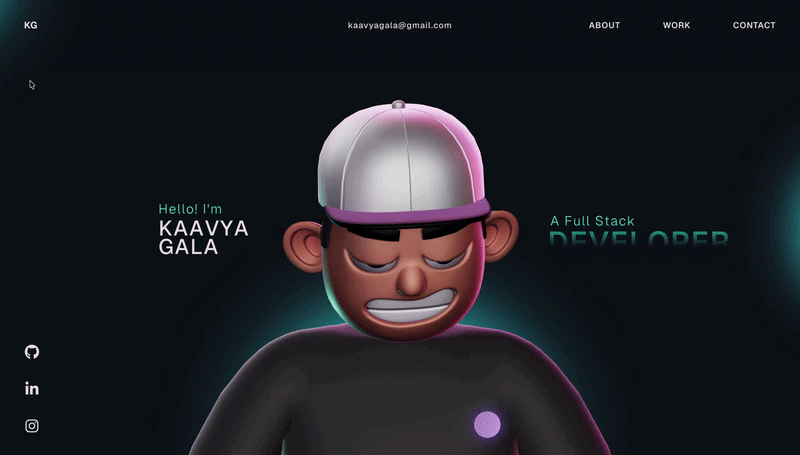

# Kaavya Gala — Portfolio

> A clean, responsive portfolio designed to showcase projects, skills, and how I approach building systems.

---

## Preview

<p align="center">
  <a href="assets/livepreview.mp4">
    
  </a>
</p>

<p align="center">
  <b>Click preview to watch full demo</b>
</p>

---

## Live Website

https://kaavya-gala-portfolio.vercel.app/

---

## Overview

This portfolio is built to present my work as a developer through a structured, visually clean, and easy-to-navigate interface.

It highlights:
- selected projects and their purpose  
- technical skills and tools  
- development approach and design thinking  

Unlike basic portfolio websites, this project focuses on structured presentation and usability, making it easy to quickly evaluate projects and technical skills.

---

## Features

- Fully responsive design (mobile, tablet, desktop)  
- Structured project showcase with GitHub links  
- Clean and modern UI  
- Smooth navigation and interaction  
- Minimal and focused layout  

---

## Sections

- **About** — background and introduction  
- **Projects** — selected work with descriptions  
- **Skills** — technologies and tools  
- **Contact** — ways to connect  

---

## Tech Stack

- **Frontend:** React + TypeScript + Vite  
- **Styling:** CSS  
- **Deployment:** Vercel  

---

## Example Usage

- Quickly review projects and their purpose  
- Navigate through skills and technologies  
- Access GitHub repositories directly  
- Understand development approach at a glance  

---

## Project Structure

```
KaavyaGala-Portfolio/
├── assets/
├── public/
├── src/
├── index.html
├── package.json
├── vite.config.ts
└── README.md
```

---

## Local Setup

```bash
git clone https://github.com/KaavyaGala546/KaavyaGala-Portfolio.git
cd KaavyaGala-Portfolio
npm install
npm run dev
```

---

## Design Philosophy

This portfolio focuses on:

- clarity over complexity  
- simplicity over clutter  
- usability over decoration  

The goal is to present work in a way that is easy to scan, understand, and navigate.

---

## Author

**Kaavya Gala**  
AI / Full Stack Developer  

GitHub: https://github.com/KaavyaGala546  

---

## Final Note

This portfolio reflects not just projects, but the way I approach building — with structure, clarity, and attention to detail.
